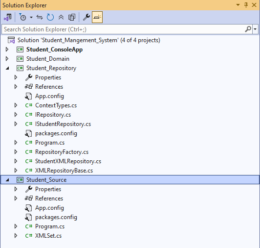

# Student Management System - Layered Architecture

## Project Overview
This repository contains a modular Student Management System developed using C# and .NET. The primary objective of this project was to implement a clean, layered architecture that effectively separates business logic, data access, and domain entities. It demonstrates the practical implementation of advanced design patterns to build maintainable software solutions.

Developed as Monthly Project 01 (Module 03) under the ISDB-BISEW IT Scholarship Programme (Submitted on: 30 October 2025), this project focuses on structured software development and core object-oriented principles.

## Project Structure
The following image showcases the layered solution architecture, highlighting the clear separation of concerns between different layers:

## Architectural Features & Design Patterns
To ensure scalability and decoupling, the following patterns and architectural standards were implemented:

* **Layered Architecture:** The solution is logically divided into specialized projects:
    * **Student_Domain:** Defines core entities, business models, and abstractions.
    * **Student_Repository:** Orchestrates data access logic through a centralized layer.
    * **Student_Source:** Manages data persistence using XML-based storage mechanisms.
    * **Student_ConsoleApp:** The presentation layer providing a command-line interface.
* **Generic Repository Pattern:** Implemented a reusable `IRepository<TEntity, TKey>` interface to standardize CRUD operations, providing a consistent API for data interaction across the system.
* **Factory Method Pattern:** Utilized the Factory Pattern (`StudentTypeCreator`) to decouple student type instantiation (Undergraduate/Graduate), allowing for flexible object creation logic.
* **Generic Entity Interface:** Employed `IEntity<TKey>` to enforce a standardized identity structure across all domain models.
* **Data Persistence (XML):** Engineered a custom `XMLRepositoryBase` to manage data using XML serialization, demonstrating expertise in file-based storage and context management.

## Technology Stack
* **Language:** C#
* **Design Patterns:** Generic Repository Pattern, Factory Method Pattern, Layered Architecture
* **Persistence:** XML Serialization
* **Framework:** .NET Framework / .NET Core

## Key Technical Skills Demonstrated
* Translating complex business requirements into scalable Object-Oriented designs.
* Effective use of abstract classes and interfaces for system modularity.
* Proficiency in handling C# generic types and constraints.
* Practical implementation of data serialization and de-serialization processes.
